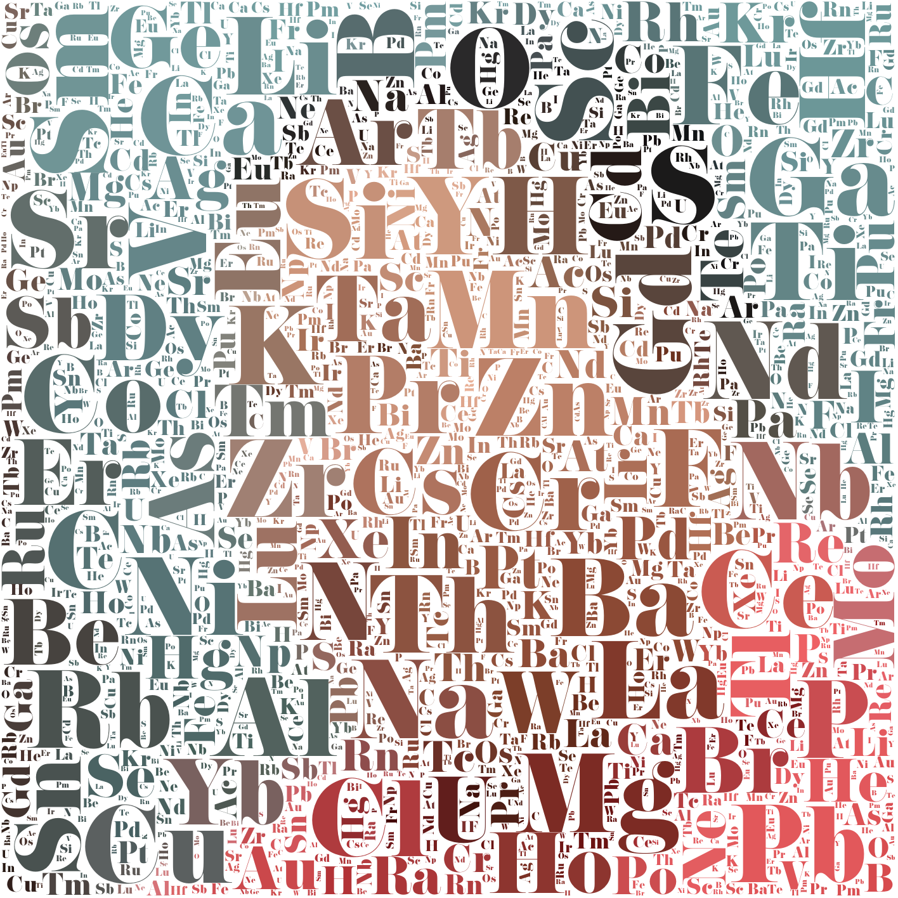

# ElementStringPicture
Preparing a special teacher's day gift for my chem teacher

# Idea💡
Use Elements to form the picture, so that seen form afar is my Chemistry Teacher teaching\
I wish to draw the human protrait in some special chemicals, but that will be for updates later

# Summary
- **sort_symbol_density.py** paste the text symbol on a square canvas, then sort them by No. of black pixel\
used to determine the optical density of elements
- **WordCloud.py** is my first version of code using the pre-made python wordcloud libary
- **BoxBruteN.py** is different version of the main programme, explanation in *Dev log*
- **folder "txt"** contain some assets, such as 
    - font I downloaded online
    - element sorted by optcial denisty
    - Abundance and yearly yield of elements in tonne (from  [wikipedia][https://www.wikiwand.com/en/Abundance_of_elements_in_Earth%27s_crust], sorted in csv)
USe PIL to process image, BS4 to extract some data

# Dev log👨‍💻

## 1. Sort symbol density
Create canvas, use PIL ImageDraw and count no. of black pixel.EZ\
This can be used for other projects, (*maybe math? which you measure greek letters...*)\
*Done on 22/7/2024*
## 2. Wordcloud?

Use the prebuilt python wordcloud lib  to colour a wordcloud to the colour of the picture.\
Result... I cannot distinguish any details.

## 3. "Boxing" via brute force V1

Before even doing it I know it will be hell of Time compextity\
actually it was fine...
### Process
1. Scan horizontal, vertical and diagonal
1. used **steps** *(a jump in increment)* to reduce time for scan
1. used **factor** *(more threshold proportion to size of square)* to encourgae larger cubes!
1. sum diff fromorigin pixel and compare to threshold
1. keep whay pixels are occupied

**there's a few varibale you wight need to adjust manually...**
### Issues
1. little details! => do a second filling with lower steps
1. we need a larger canvas
1. colour the blocks with colour from picture!

*Done on 23/7/2024*

## 4. "Boxing" via brute force V2

I did what i anticipated yesterday.. yet, it looks even shittier that the wordcloud\
I added some random rotations, it helps

### Issues
1. still...little details! => \
My mother suggest *why not just do the protrait of the face? instead of a whole picture?*\
Yea thats a **great** idea
2. algrithm can be improved for better looking result
1. **Maybe can make a wordcloud base on the abundancy of element!?**

Olevel oral tmr, wifi off at 9pm, got ot go\
p.s. changed some variables to last version, works significantly better\
*Done on 24/7/2024*

## 5. "Boxing" by relative abundace
1. I'm quite satisfied with the algrithm, so now I wanna do the size of elements by relative abundace
1. First we have to extract the data from [wikipedia][https://www.wikiwand.com/en/Abundance_of_elements_in_Earth%27s_crust]
1. I copied and pasted HTML into a file, then extract it with BS4

## 6. Wordcloud with relative abundance

1. yea eveyrthing in good progress, i just need to do up some details
1. Both Algrithm produce ok-ish result, so ill use mine
1. take a better photo and lets start drawing

**NEED to do weighting for my code!!!**
**Sort block size, then sort abundace, then map**
Olevel oral tmr(Again...), wifi off at 9pm, got ot go\
*Done on 25/7/2024*

## 7. "Boxing" by abundance abundance

1. i re-did the mapping algrithm to map *size of the box % 10* to $2^n-1$ to $2^n$ th element
1. turned out very well!! 🥳

## Credit
idk who took the photograph but the picture is my chem teacher、
Im praying nobody will steal his picture from this random github project🥲

*And... Finally Done!(27/7/2024)*